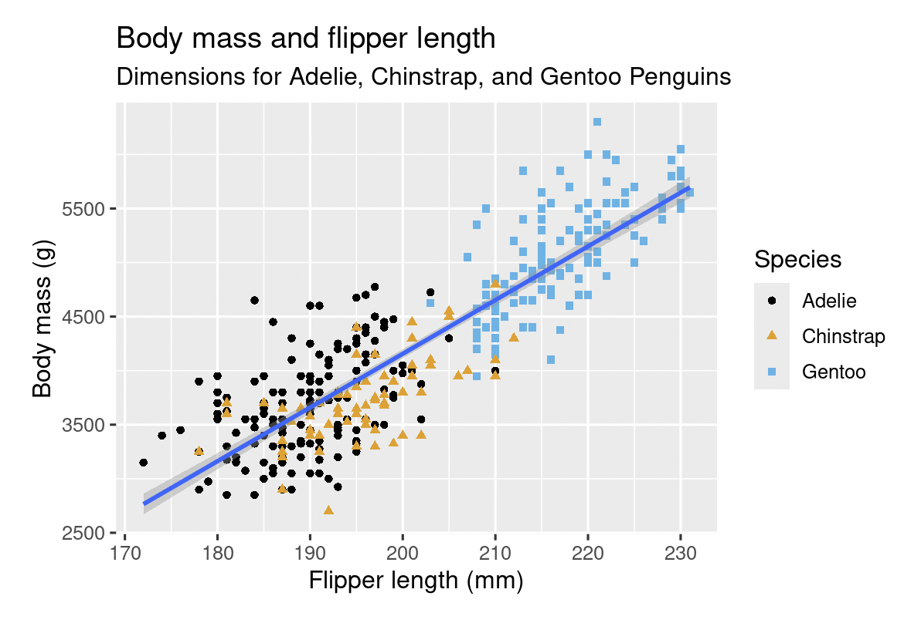

```{r setup, include=FALSE}
knitr::opts_chunk$set(echo = TRUE)
```

In this unit, we will learn a little about data visualization in R. This material is not meant to be comprehensive, but is meant to provide an introduction/starting point. The material used here can be found in *R for Data Science (2e)* (<https://r4ds.hadley.nz/>).

We will primarily use the function `ggplot` which is included in the `tidyverse` package. We load the `tidyverse` package along with two other packages. The `palmerpenguins` package contains the dataset `penguins` and the package `ggthemes` contains a colorblind safe color palette.

```{r}
library(tidyverse)
library(palmerpenguins)
library(ggthemes)
```

# Scatterplots

Let's take a look at the `penguins` dataset.

```{r}
View(penguins)
```


```{r}
ggplot(penguins) +
  geom_point(
    aes(flipper_length_mm, body_mass_g, color = species, shape = species)
    ) +
  geom_smooth(aes(flipper_length_mm, body_mass_g), method = "lm") +
  scale_color_colorblind() +
  labs(
    title = "Body mass and flipper length", 
    subtitle = "Dimensions for Adelie, Chinstrap, and Gentoo Penguins",
    color = "Species", 
    shape = "Species"
    ) +
  xlab("Flipper Length (mm)") +
  ylab("Body Mass (g)") +
  theme_xkcd()
```


The dataset includes data for penguin species, island in the Palmer Archipelago, size (flipper length, body mass, bill dimensions), and sex for 344 penguins.

Usage

The variables we will initially focus on are:

-   `species`: a penguin’s species (Adelie, Chinstrap, or Gentoo).

-   `flipper_length_mm`: length of a penguin’s flipper, in millimeters.

-   `body_mass_g`: body mass of a penguin, in grams.

GOAL: recreate the following visualization displaying the relationship between flipper lengths and body masses of these penguins, taking into consideration the species of the penguin.



So far, we have been making simple scatterplots using the `plot()` function:

```{r}
plot(penguins$flipper_length_mm, penguins$body_mass_g)
```

Now, we'll make plots using `ggplot`. `ggplot` starts with an empty graph, and adds on layers.

## Basic scatterplot

The first argument of `ggplot` indicates the dataset to be used. Our empty graph for the dataset `penguins`:

```{r}
ggplot(data = penguins)
```

A second argument *maps* the variables to the aestheics (the visual properties) of our plot.

```{r}
ggplot(
  data = penguins,
  mapping = aes(x = flipper_length_mm, y = body_mass_g)
)
```

Next, we add a *geom*, the geometrical object used to represent the data. `geom_point()` is generally used for scatterplots.

```{r}
ggplot(
  data = penguins,
  mapping = aes(x = flipper_length_mm, y = body_mass_g)
) +
  geom_point() + 
  theme_xkcd()
```

## Adding species

Now, separate the points by species using a separate color for each species. We'll add another aesthetic mapping - mapping species to color. By default, a unique color is used for each species, and a legend is added.

```{r}
ggplot(
  data = penguins,
  mapping = aes(x = flipper_length_mm, y = body_mass_g, color = species)
) +
  geom_point()
```

## Adding regression lines

We might want to add regression lines to our plot. We can do this with another geom, `geom_smooth()`. We specify that we want to use a linear model (lm) to estimate the line.

```{r}
ggplot(
  data = penguins,
  mapping = aes(x = flipper_length_mm, y = body_mass_g, color = species)
) +
  geom_point() +
  geom_smooth(method = "lm")
```

This graph gives a separate line for each of our species. We would like a line for all of the data combined. How should we do this?

-   The `mapping = aes(x = flipper_length_mm, y = body_mass_g, color = species)` argument defines mappings at the global level. All subsequent layers following this mapping. That means `geom_smooth(method = "lm")` is done separately for each color.

-   We can remove `color = species` from the global mapping and add it instead to `geom_point()`. Color/species will then only apply to the point, not to the line.

```{r}
ggplot(
  data = penguins,
  mapping = aes(x = flipper_length_mm, y = body_mass_g)
) +
  geom_point(mapping = aes(color = species)) +
  geom_smooth(method = "lm")
```

## Final changes

We can use different shapes in addition to different colors for the species by adding a shape to the `geom_point()` aesthetics.

```{r}
ggplot(
  data = penguins,
  mapping = aes(x = flipper_length_mm, y = body_mass_g)
) +
  geom_point(mapping = aes(color = species, shape = species)) +
  geom_smooth(method = "lm")
```

Now, lets add a title, subtitle, and axis labels using the `lab()` argument.

```{r}
ggplot(
  data = penguins,
  mapping = aes(x = flipper_length_mm, y = body_mass_g)
) +
  geom_point(aes(color = species, shape = species)) +
  geom_smooth(method = "lm") +
  labs(
    title = "Body mass and flipper length",
    subtitle = "Dimensions for Adelie, Chinstrap, and Gentoo Penguins",
    x = "Flipper length (mm)", y = "Body mass (g)",
    color = "Species", shape = "Species"
  )
```

We'll make one more change to a color scheme that is colorblind safe.

```{r}
ggplot(
  data = penguins,
  mapping = aes(x = flipper_length_mm, y = body_mass_g)
) +
  geom_point(aes(color = species, shape = species)) +
  geom_smooth(method = "lm") +
  labs(
    title = "Body mass and flipper length",
    subtitle = "Dimensions for Adelie, Chinstrap, and Gentoo Penguins",
    x = "Flipper length (mm)", y = "Body mass (g)",
    color = "Species", shape = "Species"
  ) +
  scale_color_colorblind()
```

Note: `data =` and `mapping =` are not necessary:

```{r}
ggplot(
  penguins,
  aes(x = flipper_length_mm, y = body_mass_g)
) +
  geom_point(aes(color = species, shape = species)) +
  geom_smooth(method = "lm") +
  labs(
    title = "Body mass and flipper length",
    subtitle = "Dimensions for Adelie, Chinstrap, and Gentoo Penguins",
    x = "Flipper length (mm)", y = "Body mass (g)",
    color = "Species", shape = "Species"
  ) +
  scale_color_colorblind()
```

We can also

-   map a numerical variable to color

-   use a smooth curve instead of a line

-   remove the error bars

```{r}
ggplot(
  data = penguins,
  mapping = aes(x = flipper_length_mm, y = body_mass_g)
) +
  geom_point(mapping = aes(color = bill_depth_mm)) +
  geom_smooth(method = "glm", se = FALSE)

ggplot(
  data = penguins,
  mapping = aes(x = flipper_length_mm, y = body_mass_g)
) +
  geom_point(mapping = aes(color = bill_depth_mm)) +
  geom_smooth(se = FALSE)
```

## Bar plots and histograms

We use bar plots for categorical variables. In this case we map the categorical variable to the x-axis, nothing to the y-axis, and we use `geom_bar()` as our geom.

```{r}
ggplot(
  data = penguins,
  mapping = aes(species)
) +
  geom_bar()
```

Some variations:

```{r}
ggplot(
  data = penguins,
  mapping = aes(y = species)
) +
  geom_bar()
```

```{r}
ggplot(
  data = penguins,
  mapping = aes(species)
) +
  geom_bar(color = "red")
```

```{r}
ggplot(
  data = penguins,
  mapping = aes(x = species)
) +
  geom_bar(fill = "red") +
  theme_xkcd()
```

We make histograms for numerical data. We use the geom `geom_histogram()`. `binwidth` controls the width of our intervals.

```{r}
ggplot(
  data = penguins,
  mapping = aes(x = body_mass_g)
) +
  geom_histogram(binwidth = 200)
```

If we use the `geom_density()` we'll get a smoothed-out histogram. This is called a density plot.

```{r}
ggplot(
  data = penguins,
  mapping = aes(x = body_mass_g)
) +
  geom_density()
```

## Boxplots (one categorical and one numerical variable)

We can make side-by-side boxplots using `geom_boxplot()`. In this case the group variable is mapped to the x-axis and the numerical variable is mapped to the y-axis.

```{r}
ggplot(
  data = penguins,
  mapping = aes(x = species, y = body_mass_g)
) +
  geom_boxplot() +
  theme_xkcd()
```

We could also make density plots for the three penguin species using `geom_density()`. Notice that we have put `color = species` in the global asthetics and the numerica variable is mapped to the x-axis.

```{r}
ggplot(
  data = penguins,
  mapping = aes(x = body_mass_g, color = species, linetype = species)
) +
  geom_density(linewidth = .75) +
  theme_xkcd()
```

## Two categorical variables

We'll look at the two categorical variables `species` and `island`. One graph we could make is a stacked bar plot. We will have a bar for each of the categories for one variable (`species`). Each bar will then be divided into the categories of the other variable (`island`). The first variable is mapped to the x-axis and the second variable is mapped to the fill of the bars.

```{r}
ggplot(
  data = penguins,
  mapping = aes(x = island, fill = species)
) +
  geom_bar() + theme_xkcd()
```

It might also be useful to compare distributions of species across islands using percentages of penguins on each island instead of counts.

```{r}
ggplot(
  data = penguins,
  mapping = aes(x = island, fill = species)
) +
  geom_bar(position = "fill") + theme_xkcd()
```

## Multiple Variables

We will consider two numerical variables, `flipper_length_mm` and `body_mass_g`, and two categorical variables, `species` and `island`.

Let's start with a scatter plot of `body_mass_g` vs. `flippler_length_mm`.

```{r}
ggplot(
  data = penguins,
  mapping = aes(x = flipper_length_mm, y = body_mass_g)
) +
  geom_point()
```

We can add color to indicate the species and shape to indicate the island.

```{r}
ggplot(
  data = penguins,
  mapping = aes(x = flipper_length_mm, y = body_mass_g)
) +
  geom_point(aes(color = species, shape = island)) +
  theme_xkcd()
```

Alternatively, we might consider separate scatterplots for each island. We can do this by splitting our plot into *facets* using `facet_wrap()`

```{r}
ggplot(
  data = penguins,
  mapping = aes(x = flipper_length_mm, y = body_mass_g)
) +
  geom_point(aes(color = species)) +
  facet_wrap(~island) +
  theme_xkcd()
```
